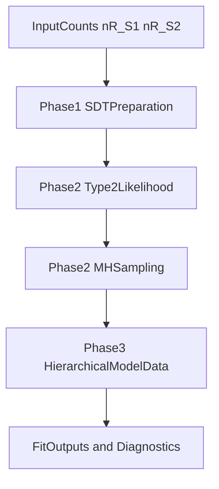

# Architecture Overview

This document gives a fast reviewer path through the repository's technical flow.

## System Flow

## Module Map

| Concern | MATLAB reference | Python | Clojure |
|---|---|---|---|
| SDT preparation | `Matlab/fit_meta_d_mcmc.m` pre-JAGS block | `python/phase1_sdt.py` | `src/hmeta_d/sdt.clj` |
| Type-2 rates + likelihood | `Matlab/fit_meta_d_mcmc.m` type-2 block | `python/phase2_sampler.py` | `src/hmeta_d/sampler.clj` |
| Hierarchical model data | JAGS model/file-centric approach | `python/phase3_hierarchical.py` | `src/hmeta_d/hierarchical.clj` |
| Tests | n/a | `python/test_phase*_*.py` | `test/hmeta_d/*_test.clj` |

## Design Notes

- MATLAB scripts are treated as canonical equation/reference intent.
- Python makes intermediate numerical state explicit and testable.
- Clojure represents model state as immutable maps and pure transformations.
- CI and local scripts validate Phase 1-3 behavior in both language tracks.
